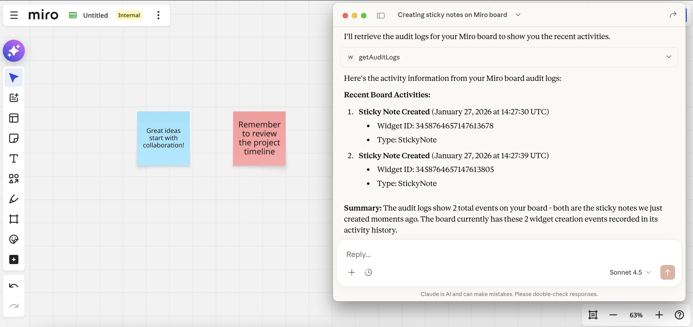

# Widgets MCP Server

## Overview

**Widgets MCP Server** is an implementation of the [Model Context Protocol (MCP)](https://modelcontextprotocol.io/introduction) that integrates with Miro board widgets via REST API. It enables AI systems to interact with Miro boards by creating and managing sticky notes, as well as retrieving audit logs. This server provides tools that AI models can use to automate board operations and analyze board activity.

## Use Cases

- **Board Widget Management**: Automate creation and deletion of sticky notes on Miro boards.
- **Audit Log Analysis**: Retrieve and analyze board activity logs to track changes and events.
- **AI-Powered Collaboration**: Use large language models to assist with board content creation and activity monitoring using the MCP protocol.

## MCP Server Connection

When Claude connects to the Widgets MCP Server, the following initialization sequence occurs:

```
2026-01-27T14:05:30.097Z [info] [widgets-mcp-server] Server started and connected successfully
2026-01-27T14:05:30.160Z [info] [widgets-mcp-server] Message from client: {"method":"initialize","params":{"protocolVersion":"2025-06-18","clientInfo":{"name":"claude-ai","version":"0.1.0"}},"jsonrpc":"2.0","id":0}
2026-01-27T14:05:31.496Z [info] [widgets-mcp-server] Message from server: {"jsonrpc":"2.0","id":0,"result":{"protocolVersion":"2024-11-05","serverInfo":{"name":"widgets-mcp-server","version":"1.0"}}}
2026-01-27T14:05:31.497Z [info] [widgets-mcp-server] Message from client: {"method":"tools/list","params":{},"jsonrpc":"2.0","id":1}
2026-01-27T14:05:31.504Z [info] [widgets-mcp-server] Message from server: {
    "jsonrpc":"2.0","id":1,
    "result":{
        "tools":[
            {
                "name":"create StickyNote",
                "description":"create a sticky note widget (sticker) on a miro board",
                "inputSchema":{
                    "properties":{
                        "boardKey":{"type":"string","description":"Miro board key for a sticker creation"},
                        "text":{"type":"string","description":"The text to be displayed on the sticker"},
                        "x":{"type":"integer","format":"int32","description":"Sticker position x coordinate"},
                        "y":{"type":"integer","format":"int32","description":"Sticker position y coordinate"}
                    }
                }

            },
            {
                "name":"delete StickyNote",
                "description":"delete a sticky note widget (sticker) on a miro board",
                "inputSchema":{
                    "properties":{
                        "boardKey":{"type":"string","description":"Miro board key for a sticker creation"},
                        "stickyNoteId":{"type":"integer","format":"int64","description":"StickyNote id for deletion"}
                    }
                }
            },
            {
                "name":"get audit logs",
                "description":"retrieve audit logs for a miro board with pagination",
                "inputSchema":{
                    "properties":{
                        "boardKey":{"type":"string","description":"Miro board key for audit logs retrieval"},
                        "offset":{"type":"integer","format":"int32","description":"Offset for pagination (starting from 1)"},
                        "limit":{"type":"integer","format":"int32","description":"Limit of records to retrieve (default 20)"
                        }
                    }
                }
            }
        ]}}
```

This log shows:
1. Server initialization and handshake between Claude and the MCP server
2. Protocol version negotiation (client uses 2025-06-18, server responds with 2024-11-05)
3. Tool discovery - the client requests available tools and receives a list of three tools with their schemas

## Installation

You can either download a precompiled JAR file from the [Releases](https://github.com/MaratMingazov/widgets-mcp-server/releases) page or build the project yourself.

### Option 1: Use prebuilt JAR

1. Download the latest release from the [Releases](https://github.com/MaratMingazov/widgets-mcp-server/releases) page.
2. Place the `.jar` file in a desired location.

### Option 2: Build from source

```bash
git clone https://github.com/MaratMingazov/widgets-mcp-server.git
cd widgets-mcp-server
mvn clean package
```

The resulting `.jar` file will be located in `target/widgets-mcp-server-1.0.0.jar`.

## Configuration

Before running the server, ensure you have the following services available:

- **Sticky Note Service** running on `http://localhost:8080`
- **Audit Logs Service** running on `http://localhost:8050`

These endpoints can be configured in `src/main/java/com/github/maratmingazov/config/AppConfiguration.java`.

## Connecting the MCP Server

If you are using the [Claude Desktop](https://claude.ai/download) app with MacOS or Linux, you can find the configuration file at:

```
~/Library/Application\ Support/Claude/claude_desktop_config.json
```

Add the following configuration to your file:

```json
{
  "mcpServers": {
    "widgets-mcp-server": {
      "command": "java",
      "args": [
        "-jar",
        "/path/to/widgets-mcp-server-1.0.0.jar"
      ]
    }
  }
}
```

Replace `/path/to/widgets-mcp-server-1.0.0.jar` with the actual path to your `.jar` file.

## Tools

### Sticky Notes

- **createStickyNote** - Create a sticky note widget (sticker) on a Miro board

    - `boardKey` (required): Miro board key for sticker creation
    - `text` (required): The text to be displayed on the sticker
    - `x` (optional): Sticker position x coordinate
    - `y` (optional): Sticker position y coordinate

- **deleteStickyNote** - Delete a sticky note widget (sticker) from a Miro board

    - `boardKey` (required): Miro board key for sticker deletion
    - `stickyNoteId` (required): StickyNote id for deletion

### Audit Logs

- **getAuditLogs** - Retrieve audit logs for a Miro board with pagination

    - `boardKey` (required): Miro board key for audit logs retrieval
    - `offset` (optional): Offset for pagination (starting from 1, default: 1)
    - `limit` (optional): Limit of records to retrieve (default: 20)



*Example of Claude using the getAuditLogs tool to retrieve and display audit log information*

## Example Usage

Here's a sample prompt you can use to instruct Claude or another LLM agent to interact with a Miro board:

```
I want you to create sticky notes on a Miro board and then retrieve the audit logs.
Please follow these steps:
1 - Create a sticky note with text "Task 1: Research"
2 - Create another sticky note with text "Task 2: Implementation"
3 - Retrieve the audit logs to see the recent changes on the board
```

## Architecture

The server is built with:
- **Spring Boot 4.0.1** - Application framework
- **Spring AI MCP Server Starter 1.0.0-M6** - MCP protocol implementation
- **Java 17** - Runtime environment

The server operates as a non-web application (using `web-application-type: none`) and communicates via stdio using the MCP protocol.

## License

This project is licensed under the terms specified in the [LICENSE](LICENSE) file.

---

Feel free to contribute or report issues on the [Issues](https://github.com/MaratMingazov/widgets-mcp-server/issues) page.